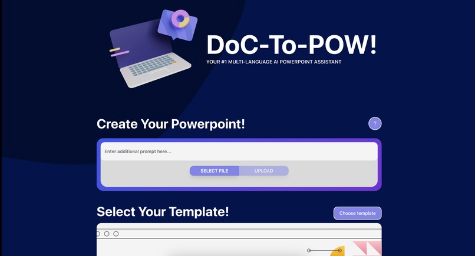
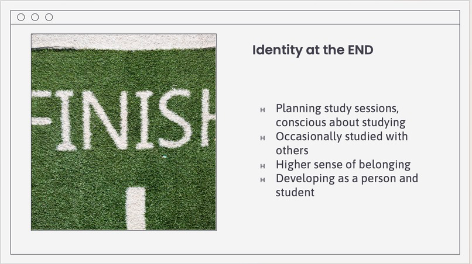
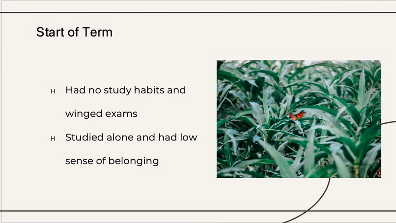

# DoC-To-PoW
**A simple-to-use tool for converting images and documents to presentation slides.**
> [!NOTE]  
> This is the front end repo of DoC-To-Pow. For back end repo, please go [here](https://github.com/Lmh-java/Dr-Pow-Backend).
## What is DoC-To-PoW
DoC-To-PoW is an AI-powered opensource service designed to quickly generate presentation slides by pre-existing documents. (For
details of document types supported, please see the following section). 
### Gallery
Main Page:

Sample Output 1:

Sample Output 2:

### Supported File Types
1. Plain Text Files
   - .txt
   - .py
   - .java
   - ...
2. Markdown Files (.md)
3. Microsoft Documents (.docx only)
4. Rich Text Files (.rtf)
5. Images
   - .png
   - .jpg
   - .jpeg

## Setup
Here are a few steps to set up the entire service.
### Front End Setup
1. Clone the front end repo
~~~bash
git clone https://github.com/clay-arras/dr-pow-frontend.git
~~~
2. Enter front end project folder
~~~bash
cd ./dr-pow-frontend
~~~
3. Install dependencies
~~~bash
npm install
~~~
4. Start the front end service
~~~
npm run start
~~~
Now, you should be able to see the front end services runs without errors.
> [!NOTE]  
> The front end service is normally running on localhost:3000. You may change to other port if necessary.

### Back End Setup
In order to run back end service, please make sure you have git and python3 installed in your device.
1. Clone the back end repo
~~~bash
git clone https://github.com/Lmh-java/Dr-Pow-Backend.git
~~~
2. Enter back end project folder
~~~bash
cd ./Dr-Pow-Backend
~~~
3. Install dependencies
~~~bash
pip install -r requirement.txt
~~~
4. Config API Keys  
Replace unsplash API key and openAI API key in config.ini with your api keys.
5. Check the Debug Flag set to false  
Go to *ppt_gen.py*, at line **20**, you will be able to see a variable named **DEBUG_FLAG**.
Make sure it is **False**. Otherwise, external API calls will be disabled, and you can only access dummy test data for output.
~~~python
import json
import logging
from typing import List

from PIL import Image
from pptx import Presentation

from template.history_template import HistoryTemplate
from template.pastel_template import PastelTemplate
from template.plain_template import PlainTemplate
from template.minimalistic_template import MinimalisticTemplate
from template.school_template import SchoolTemplate
from template.portfolio_template import PortfolioTemplate

from api.openai_api import query_chatgpt3_5
from api.unsplash_api import search_photo, download_photo

# FIXME: IF THIS IS TRUE, IT WILL DISABLE THE API CALLS AND ONLY OUTPUT DUMMY TEST DATA.
DEBUG_FLAG = False
~~~
6. Run main.py
~~~bash
python main.py
~~~

## Tech Stack
**Overview**

| Front End    | Back End   | UI / UX |
|--------------|------------|---------|
| Next UI      | SimpleAPI  | Figma   |
| React.js     | OpenAI     |         |
| Tailwind CSS | Google OCR |         |

Please see details in *package.json* for front end and *requirement.txt* for back end.

## Contributors
- [**Neil Lin**](https://github.com/clay-arras) - Front End Dev
- [**Minghao Li**](https://github.com/Lmh-java) - Back End Dev
- [**Sam Shan**](https://github.com/ssaem1) - Front End Dev
- **Jennifer Park** - UI/UX design

## Links
DevPost: https://devpost.com/software/doc-to-pow  
Neil Lin's Github: https://github.com/clay-arras  
Minghao Li's Github: https://github.com/Lmh-java  
Sam Shan's Github https://github.com/ssaem1

